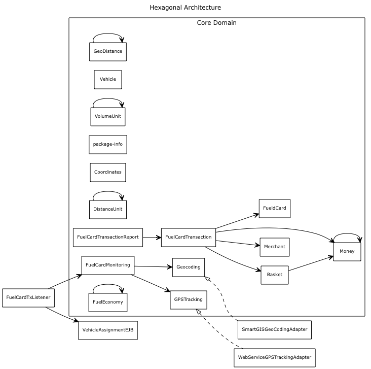
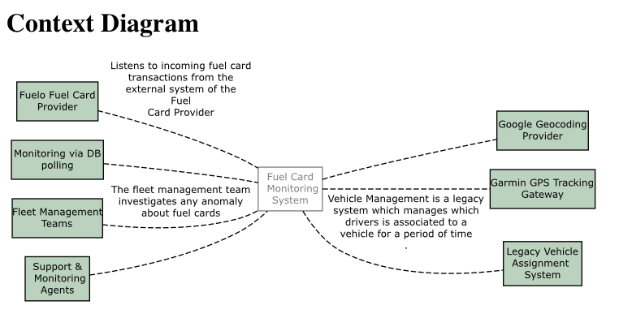
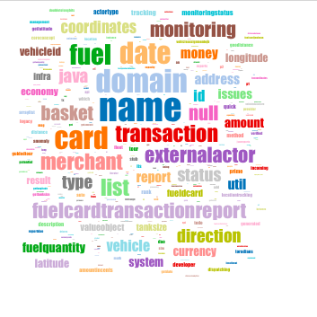

# Living Document Examples 

## Living Diagram for Hexagonal Architecture

[Source code on Github](https://github.com/cyriux/livingdocumentation-workshop/blob/master/living-documentation-workshop/src/test/java/flottio/livingdocumentation/LivingDiagramTest.java)

## Living Diagram for System Diagram (Context Diagram)

[Source code on Github](https://github.com/cyriux/livingdocumentation-workshop/blob/master/living-documentation-workshop/src/test/java/flottio/livingdocumentation/SystemDiagramTest.java)

## Living Guided Tour

[Source code on Github](https://github.com/cyriux/livingdocumentation-workshop/blob/master/living-documentation-workshop/src/test/java/flottio/livingdocumentation/LivingGuidedTourTest.java)

[An example of a generated guided tour (Markdown)](../quick_developer_tour.md)

## Living Glossary

[Source code on Github](https://github.com/cyriux/livingdocumentation-workshop/blob/master/living-documentation-workshop/src/test/java/flottio/livingdocumentation/LivingGlossaryTest.java)

[A very short example of a living glossary (Markdown)](../livingglossary.md)

## Living Word Cloud

[Source code on Github](https://github.com/cyriux/livingdocumentation-workshop/blob/master/living-documentation-workshop/src/test/java/flottio/livingdocumentation/WordCloudTest.java)

and [its companion "parser"](https://github.com/cyriux/livingdocumentation-workshop/blob/master/living-documentation-workshop/src/test/java/flottio/livingdocumentation/WordCloud.java)

